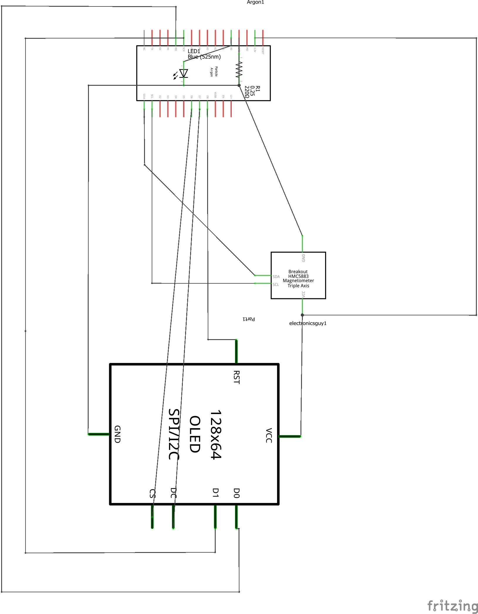

# BarDevice

A Particle project named BarDevice.
Firmware for bar mounted device, measuring acceleration and pitch.
To be used in conjuction with a [WearableDevice](https://github.com/BrentonAD/SIT730-ProjectPrototype-WearableDevice)

## Description
The firmware of the bar device runs on the configured frequency of the accelerometer. When data form the accelerometer becomes available the tilt is calculated using trigonometry from the x and z-axis acceleration. This information is transmitted through BLE with a specific buffer signature for the wearable device to receive, however if the tilt is beyond an extreme threshold the device’s LED will light up. The bar device also aggregates the joint acceleration magnitude data at 32ms intervals and plots it onto the built-in OLED display. The line chart refreshes every four seconds once the screen has been filled.

## Architecture
For the expected connectivty of the system, see circuit schematic below:



The required hardware is as follows:
- Particle Argon
- 3-Axis Accelerometer (MMA8452Q)
- OLED Display (1.3 Inch SH1106)
- LED + Resistor (220Ohms)

## Repository Structure

#### ```/src``` folder:  
This is the source folder that contains the firmware files for your project. It should *not* be renamed. 
Anything that is in this folder when you compile your project will be sent to our compile service and compiled into a firmware binary for the Particle device that you have targeted.

Particle library dependencies are specified in the `project.properties` file referenced below.

#### ```.ino``` file:
This file is the firmware that will run as the primary application on your Particle device. It contains a `setup()` and `loop()` function, and can be written in Wiring or C/C++. For more information about using the Particle firmware API to create firmware for your Particle device, refer to the [Firmware Reference](https://docs.particle.io/reference/firmware/) section of the Particle documentation.

#### ```project.properties``` file:  
This is the file that specifies the name and version number of the libraries that your project depends on. Dependencies are added automatically to your `project.properties` file when you add a library to a project using the `particle library add` command in the CLI or add a library in the Desktop IDE.

## Compiling your project

When you're ready to compile your project, make sure you have the correct Particle device target selected and run `particle compile <platform>` in the CLI or click the Compile button in the Desktop IDE. The following files in your project folder will be sent to the compile service:

- Everything in the `/src` folder, including your `.ino` application file
- The `project.properties` file for your project
- Any libraries stored under `lib/<libraryname>/src`
